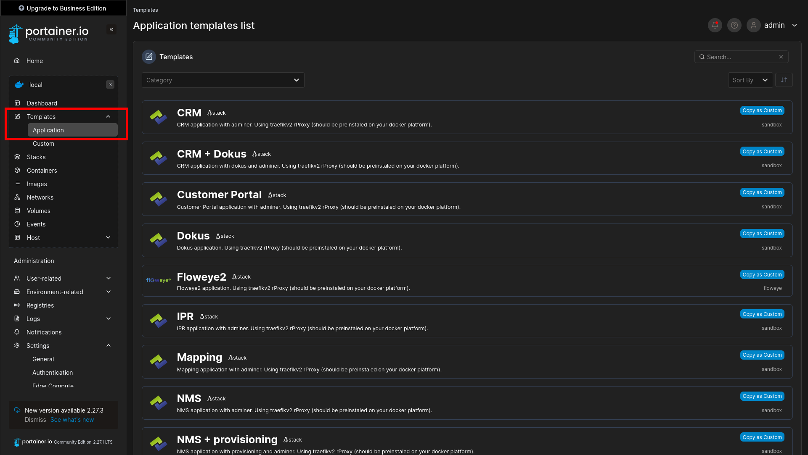
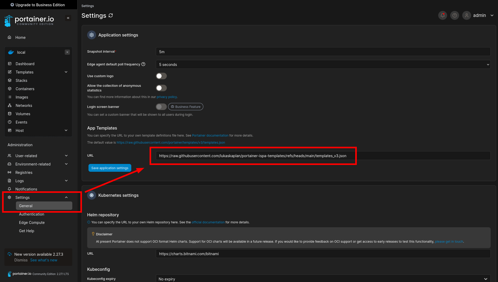

# portainer-ispa-templates

Templates of ISP Alliance's docker apps, designed for easy deployment via [Portainer](https://www.portainer.io/).

Portainer documentation of the app templates [here.](https://docs.portainer.io/advanced/app-templates/format#stack-template-definition-format)

**Minimum supported Portainer version: 2.20.0**

:warning: **Recommended portainer version at this time is 2.21.5 LTS!** Because of [this bug](https://github.com/issues/created?issue=portainer%7Cportainer%7C12654).

Templates use the version 3 format, which requires Portainer 2.20.0 or newer.

## Contents
 - `templates_v3.json` – the main template file compatible with Portainer (v3 format).
 - `stacks/` – directory with individual stack definitions (e.g., `docker-compose.yml` files).

## Usage

  1. Log into your Portainer web UI
  2. Under Settings --> General --> App Templates, update the URL to

        `https://raw.githubusercontent.com/lukaskaplan/portainer-ispa-templates/refs/heads/main/templates_v3.json`

  3. Now under Templates --> Application, you should see all apps. Click one to deploy.

## License

This project is licensed under the MIT License.
